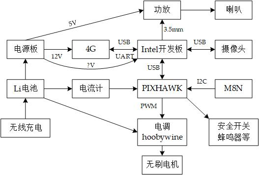

# Keyword

- 无线充电
- Pixhawk
- 平衡充

## 任务概述

1. 测试了无线充电
2. 学习Pixhawk的生态环境
3. 烧写Pixhawk的固件为4旋翼
4. 校准Pixhawk的罗盘等参数
5. 买了接收机和数传

## 硬件任务详述

### 无线充电

> 负责人：江榕煜

达成情况：目前无线充电模块已经通过测试，并且我写了一篇博客来记录测试[XTK无线充电](https://www.singularity-blog.top/2020/07/04/%E6%97%A0%E7%BA%BF%E5%85%85%E7%94%B5(XKT)/)

任务结论：该充电模块充电效率很低，实测49%，但是对于这次比赛来说，在演示方面是没有问题的，该充电方案可行

后续任务：

1. 使用无线充电模块给电池充电，以及无线充电指示功能
2. 由于该无线充电模块有个BUG，距离不能离太近，所以要做一个外壳

### Pixhawk使用

> 负责人：江榕煜

达成情况：

1. 烧写了4轴旋翼的固件进去
2. 校准了Pix和M8N共同工作时的罗盘、陀螺仪、定位等
3. 基本掌握Pixhawk搭建无人机的硬件接线等

存在的问题：

1. 之前王老师寄过来的时候，接收机线断了，刚买还没到
2. 没有数传，也是刚买还没到

后续工作：

1. 等数传和接收机到了，就可以联调无人机了
2. 调试无人机的PID参数
3. 无人机与上位机的通信（MAVlink，还不确定要不要二次开发）

### 硬件架构

> 负责人：江榕煜

在经过对PIX飞控和4G模块等的测试后，基本确定硬件架构如下：

## 软件任务详述

# 佟星宇

### 任务关键词

带口罩的人脸识别

### 任务描述

* 带口罩的人脸识别：文献调研，现有训练完成模型测试。
* 深度学习架构学习：正在学习TensorFlow架构及优化算法。

### 任务详述

搜集到已训练好的模型如下：

https://github.com/AIZOOTech/FaceMaskDetection

优点：轻量化模型，对算力需求较小，且根据实际测试，检测效果和fps较优。

缺点：因为其为轻量化模型，对照片的清晰度有要求，过小的人脸的识别准确度不如更加大型的模型。

以使用测试集对模型性能进行测试，测试集使用的是武汉大学的AFDB口罩人脸数据集，从中随机选择2000张图片进行测试，识别准确率达到92%，响应速度在0.03s到0.06s之间（即15~30fps）基本满足本项目需求。

后续工作：

1. 等待硬件方面无人机调试正常，使用无人机实机拍摄的视频进行识别测试。
2. 与人体特征识别的任务进行联调，实现在口罩识别的基础上，识别出未带口罩的人的人物信息提取。
3. 研究无人机定点降落需要的视觉辅助相关软件知识。

## 人脸特征识别
>负责人：陈映李  
### 任务详述
* 衣服颜色识别：尚无进展。
* 性别检测：了解了基本原理。根据教程配置了Win10系统下OpenCv+VSCode+C++的环境。测试了OpenCv封装的人脸检测函数。可通过FaceRecognizer类实现性别识别。此外，还采用CMU大学CNBC数据集配合TensorFlow框架下的CNN训练测试。针对亚洲面孔训练得到的测试结果为91.30%。https://github.com/liuyuhang997/gender-recognition
### 下周后续工作
1. 由于目前为了便于学习和快速上手，训练的数据集还未包含有口罩人脸。下一步打算借用已有的网络模型，用无口罩人脸+有口罩人脸的数据集测试，有口罩人脸训练。（数据集需要自己酌情混合；现有的有口罩人脸未标注性别，由于采用有监督学习，需手动标注）
2. 寻找更合适的算法。性别检测属于二分类问题，既可以用CNN实现，也可以用传统方法。本周为了便于学习选择了有中文注释代码的算法。更合适方案应该轻量化并有较高准确度。
3. 了解和熟悉tensorflow和caffe框架。（这是由于很多star很多的仓库用的caffe）
4. 思考衣服颜色识别的具体方案。
