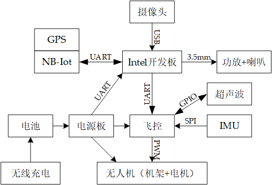

# Intel杯周工作情况汇报

- 周次：第一周
- 时间：2020.6.29

## 软件工作进度

### 架构设计

> 负责人：

### 人物特征识别

> 负责人：

### 口罩特征识别

> 负责人：

### other

## 硬件工作进度

### 物资采购

> 负责人：江榕煜

已采购内容：

1. 飞控（Pixhawk）
2. 定位模块（M8N）
3. Iot通信模块
4. 无线充电模块

待采购内容（需等开发板接口确认）：

1. 音频合成放大模块
2. 摄像头

无人机、仪器等正在路上

### 硬件架构设计

> 负责人：江榕煜、佟星宇、陈映李

如图：

